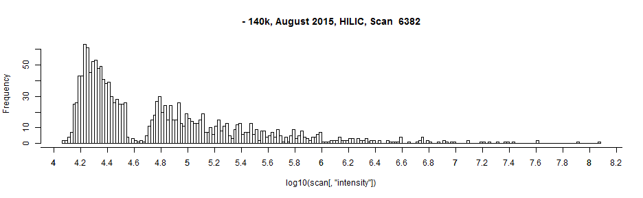

# Intensity Distribution on the QE Plus

Plotted are the distribution of intensities in several spectra from three files.  These spectra were acquired on the QE Plus at different resolutions, on different instruments, in different polarities, and at different times with different tunes.

The distribution of intensities is displays a consistent gap, aproximately 10^0.2 intensity units wide.  Its position moves between 10^4.5 to 10^5.4.   

I am trying to figure out the cause of this gap.  By all my reasoning this gap shouldn't naturally exist. Isotopes are fairly well distributed through the intensity space, combined with adducts  and fragments we should see a fairly canonical long tailed distribution.  Instead we see a bimodal distribution with a derth of ions around I = 10^4.8.

Guesses:
 - Your intensity calibration algorithm has two regimes, high I and low I.  This is where they meet.
 - Somehow we physically disriminate against ion clouds of this density. (unlikely?)
 - Some additional processing (noise/harmonic removal, peak shaping, ft) discriminates against ions of this intensity.
 
Request:
 - An explanation of the behavior
 - Verification that we are not loosing ions but rather we are skewing intensities.
 
Hopefully this is also a helpful observation.
 

 

```r
library(xcms)

xr = xcmsRaw("X:/Nate/Q Exactive Plus/2NM118A_AnnoHILICWgN/creDBle processing 042016/mzxml/2NM118A_HILICAnnoWgN14_2NM111G_12.mzXML")

for (i in seq(2, length(xr@scantime), by = round(length(xr@scantime)/10))) {
  scan = getScan(xr, i)  
  hist(log10(scan[,"intensity"]), breaks = 250, main = paste("- 140k, August 2015, HILIC, Scan ", i))
  axis(side=1, at=seq(0,10, 0.2), labels=seq(0,10,0.2))
  }
```



```r
xr = xcmsRaw("X:/Nate/Q Exactive Plus/2NM125_GluNAD Direct Infusion/glunad infusion 280k/pos100-1500.mzXML")

for (i in seq(2, length(xr@scantime), by = round(length(xr@scantime)/10))) {
  scan = getScan(xr, i)  
  hist(log10(scan[,"intensity"]), breaks = 250, main = paste("+ 280k, May 2016, Direct Infusion, Scan ", i))
  axis(side=1, at=seq(0,10, 0.2), labels=seq(0,10,0.2))
}
```


```r
xr = xcmsRaw("X:/Nate/Q Exactive Plus/2NM93B First Test Neg/2NM97B_QE_02_2NM93E_Lyo_1t2.mzxml")

for (i in seq(2, length(xr@scantime), by = round(length(xr@scantime)/10))) {
  scan = getScan(xr, i)  
  hist(log10(scan[,"intensity"]), breaks = 250, main = paste("+, November 2014, Chromatography, Previous Instrument, Scan ", i))
  axis(side=1, at=seq(0,10, 0.2), labels=seq(0,10,0.2))
}
```


```r
scan = read.csv("scan.csv", skip = 5)
hist(log10(scan[,"Intensity"]), breaks = 250, main = paste("No msconvert. Qual Browser - 140k, August 2015, HILIC, Scan ", 2287))
axis(side=1, at=seq(0,10, 0.2), labels=seq(0,10,0.2))
```


The last histogram is a file that was not converted.  The spectrum was taken directly from qual browser
